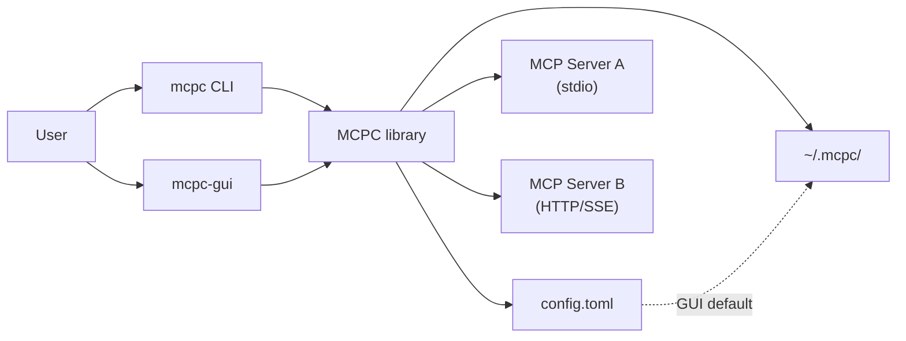
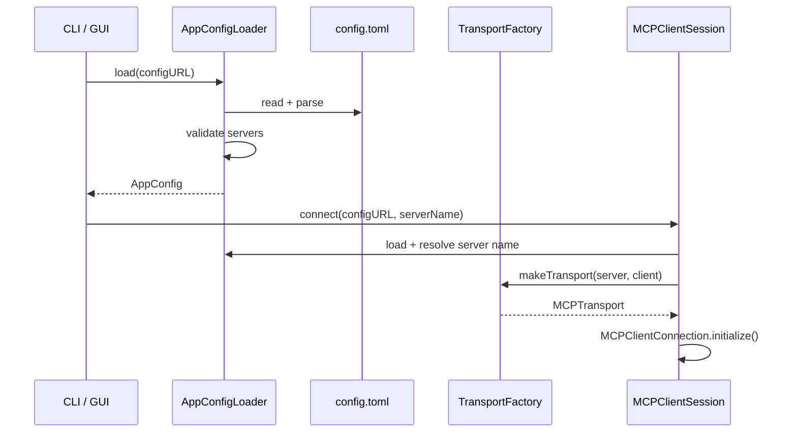
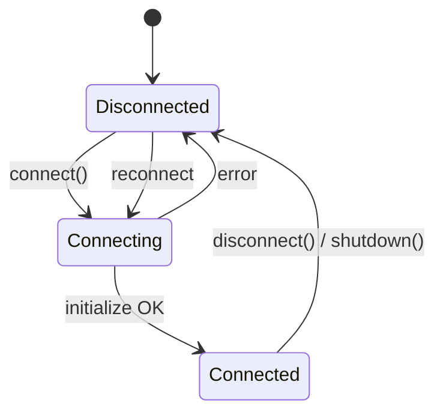
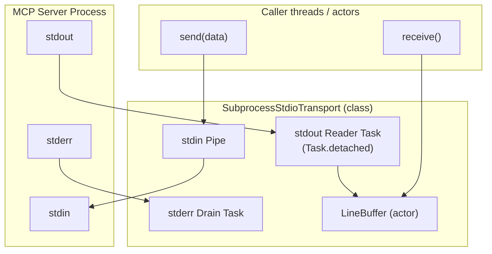
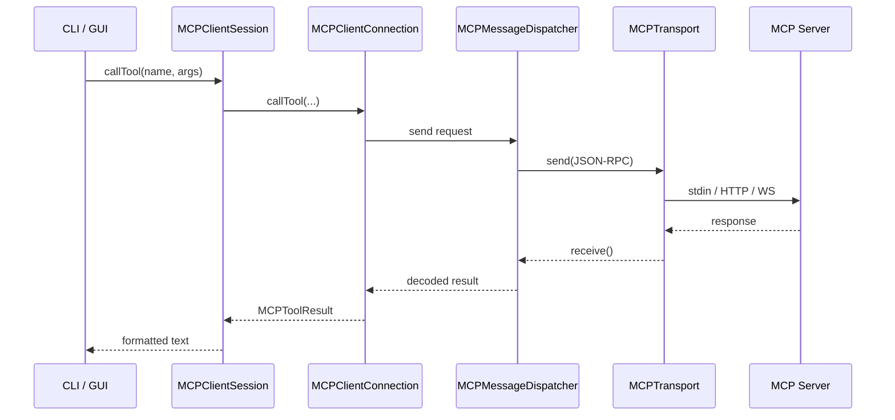
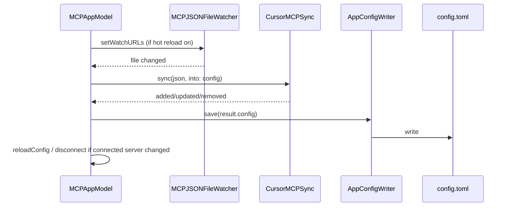
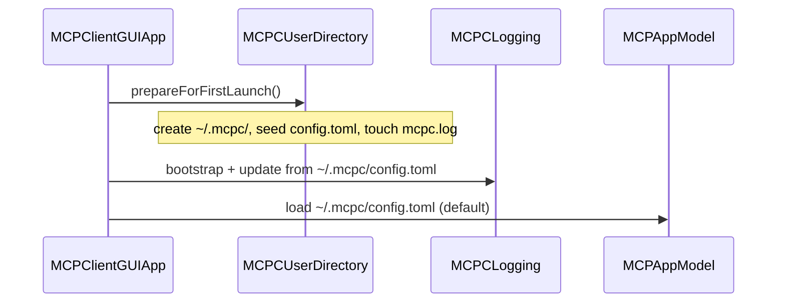
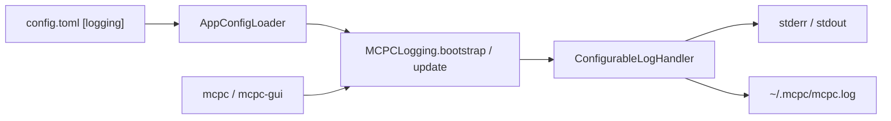
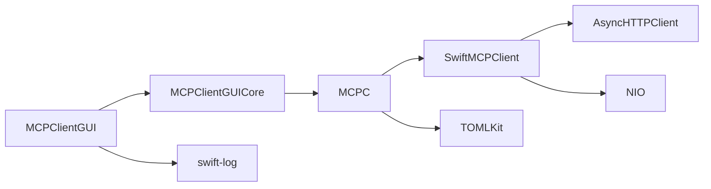
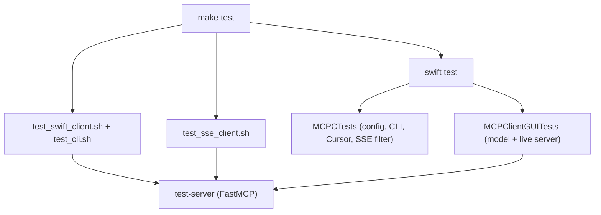

# MCPC High-Level Design

This document describes the architecture of MCPC: major components, data flows, concurrency model, and key design decisions.

## 1. System context

MCPC sits between a human operator (CLI or GUI) and one or more MCP servers. It does not host models or business logic itself; it is a protocol client that discovers and invokes server capabilities.



**MCP Client** (packaged GUI) stores config and logs in `~/.mcpc/`, created on first launch via `MCPCUserDirectory`. Development and CLI workflows may use `./config.toml` or `MCPC_CONFIG` instead.

## 2. Layered architecture

```
┌─────────────────────────────────────────────────────────┐
│  Presentation                                           │
│  MCPClientCLI (main.swift)  │  MCPClientGUI (SwiftUI)  │
│                             │  MCPClientGUICore (model)  │
├─────────────────────────────────────────────────────────┤
│  Application / Session                                  │
│  MCPClientSession (actor)                               │
├─────────────────────────────────────────────────────────┤
│  Configuration & Transport                              │
│  AppConfigLoader │ MCPCUserDirectory │ MCPCLI │ Cursor* │
│  TransportFactory │ SubprocessStdio │ SSETransportAdapter│
├─────────────────────────────────────────────────────────┤
│  Protocol (external)                                    │
│  SwiftMCPClient — MCPClientConnection, MCPTransport     │
└─────────────────────────────────────────────────────────┘
```

| Layer | Responsibility |
|-------|----------------|
| **Presentation** | Argument parsing, UI state, formatting output for humans |
| **Session** | Single-server connection lifecycle, MCP method wrappers |
| **Configuration** | TOML load/validate, transport construction |
| **Protocol** | JSON-RPC framing, MCP message dispatch (SwiftMCPClient) |

## 3. Package structure

```
Package: mcpc
├── MCPC (library)
│   ├── AppConfig.swift / AppConfigLoader / AppConfigWriter
│   ├── MCPCLI.swift              CLI argument parsing (testable)
│   ├── MCPClientSession.swift    Public session API
│   ├── TransportFactory.swift    Server → MCPTransport
│   ├── SubprocessStdioTransport  Custom stdio implementation
│   ├── SSETransportAdapter.swift FastMCP-compatible SSE wrapper
│   ├── CursorMCPConfigImporter   Parse Cursor mcp.json
│   ├── CursorMCPSync             Merge + hot-reload sync
│   ├── MCPJSONFileWatcher        macOS FSEvents watch
│   ├── LineBuffer.swift          Async line queue for receive()
│   └── MCPCLogging.swift         swift-log bootstrap
├── MCPClientGUICore (library)
│   └── MCPAppModel.swift         @Observable model, JSON parsers
├── MCPClientCLI                  Thin CLI over MCPClientSession + MCPCLI
├── MCPClientGUI                  SwiftUI views over MCPClientGUICore
│   ├── ContentView / ImportCursorServersSheet
│   └── ToolsView / ResourcesView / PromptsView
├── Tests/
│   ├── MCPCTests                 Unit tests for MCPC
│   └── MCPClientGUITests         Unit + integration tests for GUI core
└── packaging/ + scripts/         DMG templates, test runners
```

## 4. Configuration flow



**Design choice:** Configuration is file-based TOML rather than JSON to align with human-editable multi-server definitions and Cursor-style `[[servers]]` arrays.

## 5. Connection lifecycle



### Session creation

1. `MCPClientSession.connect` loads config and resolves server name (`--server` or `default_server`).
2. `TransportFactory` builds the appropriate `MCPTransport`.
3. `MCPClientConnection` is created with `requestTimeout` from config.
4. `initialize(clientName, clientVersion, protocolVersion)` completes handshake.
5. `InitializeResult` is stored for display (server name/version).

### Teardown

1. `MCPClientConnection.disconnect()` stops the message dispatcher.
2. Transport `disconnect()` closes pipes / sockets and terminates subprocess.
3. GUI `shutdown()` also clears catalog state (tools, resources, prompts).

## 6. Transport design

### 6.1 Factory pattern

`TransportFactory.makeTransport(for:client:)` maps `ServerTransport` enum to a concrete transport:

| Transport | Implementation | Source |
|-----------|----------------|--------|
| `stdio` | `SubprocessStdioTransport` | MCPC (custom) |
| `sse` | `SSETransportAdapter` → `HTTPSSETransport` | MCPC + SwiftMCPClient |
| `streamable_http` | `StreamableHTTPTransport` | SwiftMCPClient |
| `websocket` | `WebSocketTransport` | SwiftMCPClient |

### 6.2 Stdio transport (critical path)

Most local MCP servers use stdio (Swift binaries, Node, Python, etc.). MCPC implements a custom transport because subprocess management and deadlock avoidance require tight control.



**Concurrency model:**

- `SubprocessStdioTransport` is a **`final class`** (not an actor) so `send` and `receive` are not serialized on one executor.
- A **detached background task** continuously reads stdout and pushes complete newline-delimited lines into `LineBuffer`.
- `receive()` awaits the next line from `LineBuffer`; multiple concurrent receives are serialized by the buffer actor.
- **stderr is drained** on a separate task so a chatty server cannot block stdout and deadlock the client.

**Deadlock that motivated this design:** An earlier actor-based transport caused `MCPMessageDispatcher`'s read loop to block in `receive()` while `send()` waited on the same actor — after `initialize`, no further messages could be sent.

### 6.3 LineBuffer

`LineBuffer` is an actor bridging the synchronous pipe reader and async `receive()` callers:

- `enqueue(_:)` — reader pushes a line; resumes a waiting continuation or buffers
- `dequeueOrWait(isConnected:)` — consumer waits for next line or throws `transportClosed`
- `cancelWaiters()` — on disconnect, resumes waiters with `CancellationError`

### 6.4 Subprocess environment

`ProcessEnvironment.mcpSubprocess` copies a minimal set of parent env vars (`HOME`, `PATH`, etc.) and merges per-server `env` overrides from `config.toml`. This avoids inheriting a huge or incompatible environment. The bundled Python test server sets `PYTHONUNBUFFERED=1` in its own `[[servers]]` entry.

## 7. MCP message flow



SwiftMCPClient owns JSON-RPC encoding, request/response correlation, and timeout handling. MCPC does not reimplement the wire protocol.

## 8. CLI architecture

The CLI executable is a thin router over shared library code:

1. `MCPCLI.parseArguments` → `MCPCLIOptions` (config path, server name, command)
2. `list-servers` short-circuits without opening a session
3. All other commands: `MCPClientSession` → execute → `await disconnect()`
4. Formatters (`MCPToolContentFormatter`, `MCPResourceContentFormatter`) convert MCP content types to plain text

`MCPCLI` lives in **MCPC** so argument parsing is covered by `MCPCTests` without subprocess spawning.

No persistent state between invocations — each run is an isolated session.

## 9. GUI architecture

### 9.1 MV pattern with Observation

```
MCPClientGUIApp (executable)
    └── ContentView + ImportCursorServersSheet
            ├── SidebarView        (config + servers + Cursor import)
            ├── ConnectionBar      (connect / ping / status)
            ├── TabView            (Tools / Resources / Prompts)
            └── OutputPanel

MCPClientGUICore
    └── MCPAppModel (@MainActor @Observable)
            ├── UI state (connection, catalogs, selections, output)
            ├── session: MCPClientSession?
            ├── MCPJSONFileWatcher (via MCPC)
            └── async operations via Task { }
```

`MCPAppModel` is the single source of truth. SwiftUI views in `MCPClientGUI` import `MCPClientGUICore` and bind with `@Bindable`. The model spawns `Task` blocks for async MCP work and updates observable properties on the main actor.

### 9.2 JSON argument editing

`JSONArgumentsParser` (in `MCPClientGUICore`) generates starter JSON from tool `inputSchema` properties or prompt argument names. User edits in `TextEditor`, then the model decodes to `[String: AnyCodableValue]` or `[String: String]` before calling the session.

### 9.3 Cursor sync flow



Manual import uses the same `CursorMCPSync` path via `ImportCursorServersSheet`.

### 9.4 App lifecycle

**Startup** (`MCPClientGUIApp.init`):



`prepareForFirstLaunch()` is idempotent: existing `config.toml` is never overwritten.

**Shutdown** — `MCPClientGUIApp` calls `model.shutdown()` on:

- `scenePhase == .background`
- `NSApplication.willTerminateNotification`

This reduces races where the message dispatcher logs `transportClosed` during teardown.

## 10. Logging architecture

MCPC uses [swift-log](https://github.com/apple/swift-log) with a single bootstrap at process start and runtime-updatable settings from `config.toml`.



When `destination = "file"`, `ConfigurableLogHandler` appends to the path from `LoggingSettings.resolvedLogFileURL()` (relative names resolve under `~/.mcpc`). The production GUI template enables file logging by default.

| Logger label | Component |
|--------------|-----------|
| `mcpc.config` | Config load |
| `mcpc.session` | Connect / disconnect |
| `mcpc.transport` | Transport factory |
| `mcpc.transport.stdio` | Subprocess spawn, send/receive |
| `MCPClient.*` | SwiftMCPClient (level controlled via `logging.components`) |

`ConfigurableLogHandler` reads levels dynamically from `LoggingConfiguration`, so the GUI can call `MCPCLogging.update(with:)` when the user picks a new config file without re-bootstrapping.

## 11. External dependencies



| Dependency | Role in MCPC |
|------------|--------------|
| SwiftMCPClient | MCP protocol, HTTP/SSE/WS transports, connection actor |
| TOMLKit | Parse `config.toml` into Swift structs |
| swift-log | Structured logging for MCPC and GUI |

## 12. Test architecture



| Layer | Coverage |
|-------|----------|
| **MCPCTests** | Config validation, `MCPCLI` parsing, Cursor import/sync, `AppConfigWriter`, SSE JSON filter |
| **MCPClientGUITests** | `JSONArgumentsParser`, `MCPAppModel` unit tests, connect/call-tool/ping integration |
| **Shell scripts** | End-to-end CLI over stdio and SSE against the bundled test server |

The test server supports `--transport stdio` (default) and `--transport sse`. Integration tests require **uv** to spawn the Python server.

## 13. Packaging architecture

```
make dmg
    └── scripts/create_dmg.sh
            └── scripts/package_app.sh
                    └── swift build -c release --product mcpc-gui
                    └── dist/MCP Client.app (Info.plist + codesign)
                    └── dist/MCP Client-<version>.dmg (hdiutil)
```

DMG staging includes `Applications` symlink, `config.toml.example`, and `DMG_README.txt`. The app bundle does not ship a live user config; first launch runs `MCPCUserDirectory.prepareForFirstLaunch()` to create `~/.mcpc/`. DMG build version comes from `[app].version` in the repository `config.toml`.

## 14. Security considerations

| Area | Approach |
|------|----------|
| Secrets in config | No encryption; use `config.local.toml` (gitignored) or env vars in `servers.env` |
| Subprocess spawn | Runs arbitrary `command` from config — treat config as trusted |
| TLS | `trust_self_signed_certificates` opt-in for dev only |
| Network | Remote transports connect only to configured URLs |

## 15. Key design decisions

| Decision | Rationale |
|----------|-----------|
| TOML over JSON | Multi-server arrays, comments, Cursor familiarity |
| Custom stdio transport | Subprocess env control, stderr drain, deadlock fix |
| Class + background reader | Avoid actor contention between send and receive |
| Actor for `MCPClientSession` | Safe concurrent access from GUI tasks |
| Stateless CLI | Simple scripting; no daemon to manage |
| Library extraction (`MCPC`) | Shared logic between CLI and GUI |
| `MCPClientGUICore` split | Testable GUI model without SwiftUI executable dependency |
| `MCPCLI` in library | Unit-testable argument parsing |
| `SSETransportAdapter` | Filter non-JSON POST ack bodies (FastMCP `202 Accepted`) |
| Minimal subprocess env | Predictable stdio subprocess behavior; per-server `env` in config |
| `MCPJSONFileWatcher` sync deinit | Avoid async `stop()` race on deallocation |
| `~/.mcpc` user directory | Standard macOS per-user config/log location; idempotent first-launch seeding |

## 16. Extension points

Future work can hook in at these boundaries without rewriting the stack:

- **New transport types** — extend `ServerTransport` + `TransportFactory`
- **Embedded apps** — depend on `MCPC` product, call `MCPClientSession` directly
- **Alternate UIs** — reuse session + config, replace SwiftUI layer
- **Config sources** — wrap or replace `AppConfigLoader` (e.g. remote config service)

## 17. Related documents

- [README.md](../README.md) — project overview and quick start
- [SPEC.md](SPEC.md) — detailed behavioral specification
- [USER_GUIDE.md](USER_GUIDE.md) — installation and usage instructions
